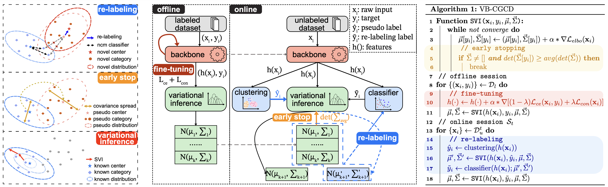

<div align="center">

<h2>Continual Generalized Category Discovery:

Learning and Forgetting from a Bayesian Perspective</h2>

[Hao Dai](https://github.com/daihao42), [Jagmohan Chauhan](https://sites.google.com/view/jagmohan-chauhan/home)

University College London

Universityof Southampton

[](LICENSE)

</div>
<div align="center">

</div>

## Usage

### Installation

```
conda create -n vbcgcd python=3.12.2
conda activate vbcgcd
pip install -r requirements.txt
mkdir datasets
```

## Prepare Datasets

```
python feature_extractor/dino-cifar100.py --finetuned --output_dir datasets/cifar100
```

## Training

```
python main.py --base 50 --increment 10 --pretrained_model_name dino-vitb16-sl --data_dir datasets/cifar100 --trail_name mix_increment_mngmm_dinovb16_sl_cifar_100
```

## Citation

If you find our work useful, please cite our related paper:

```
# ICML 2025
@inproceedings{dai2025vbcgcd,
  title={Continual Generalized Category Discovery: Learning and Forgetting from a Bayesian Perspective},
  author={Dai, Hao and Jagmohan, Chauhan},
  booktitle={Proceedings of the 42nd International Conference on Machine Learning (ICML)},
  year={2025}
}

```
